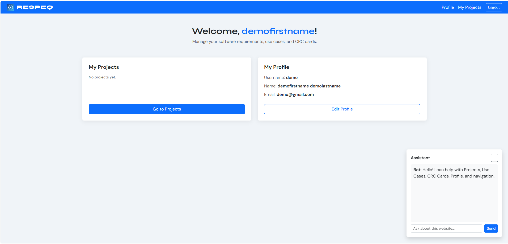
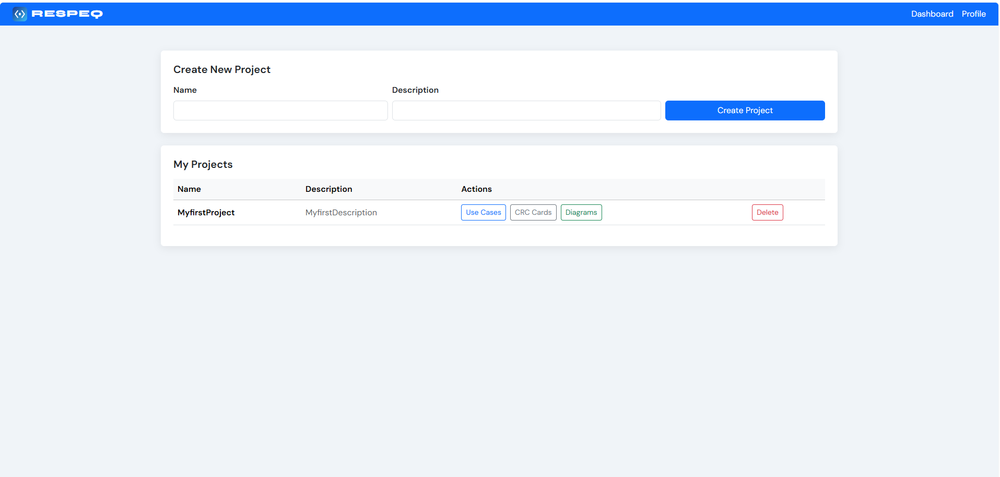
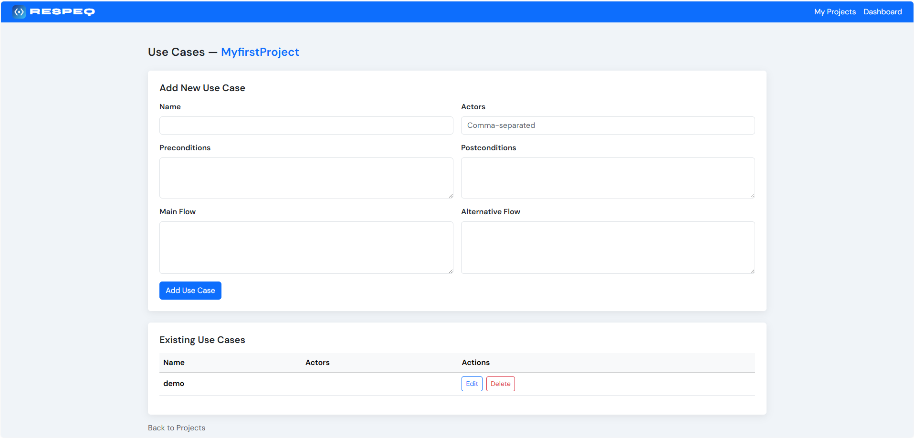
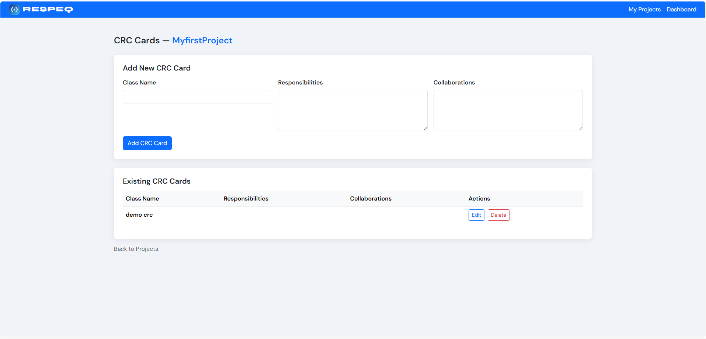
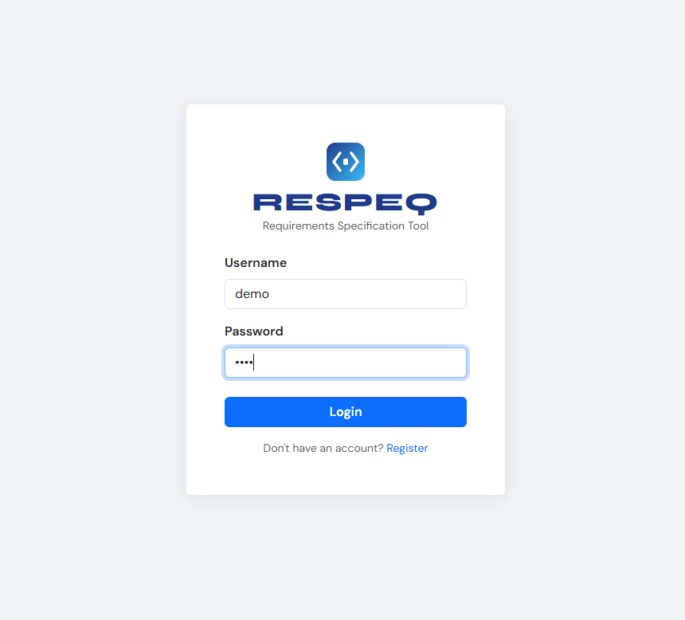
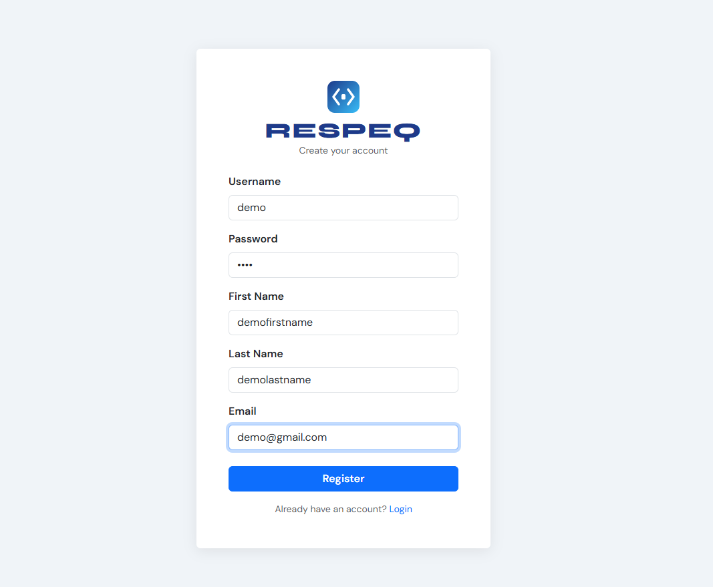

# Software Design Platform with a chatbot

A Spring Boot web application for managing software projects, use
cases, CRC cards and diagrams.Users can create projects, document use cases, manage CRC cards, 
generate diagrams and use an AI assistant powered through the Groq API.


## Features

- User registration, login and profile management
- Create and manage software projects
- Document and edit use cases
- Create and manage CRC cards
- Generate and view project diagrams
- AI assistant with page context
- Persistent storage with MySQL

## Technologies

- Java 17
- Spring Boot
- Spring MVC
- Spring Security
- Spring Data JPA
- Thymeleaf
- MySQL
- Groq API
- Maven

  ## Local Setup

### Requirements

- Java 17
- MySQL
- A Groq API key

### 1. Clone the repository

```bash
git clone https://github.com/leuterisiosifidis/software-design-platform-with-chatbot.git
cd software-design-platform-with-chatbot
```

### 2. Configure the environment variables

On Windows PowerShell:

```powershell
$env:DB_USERNAME="root"
$env:DB_PASSWORD="your_mysql_password"
$env:GROQ_API_KEY="your_groq_api_key"
```

The default database is:

```text
myy803db
```

The application creates the database and required tables when it starts.

### 3. Run the application

On Windows:

```powershell
.\mvnw.cmd spring-boot:run
```

On Linux or macOS:

```bash
./mvnw spring-boot:run
```

Open the application at:

```text
http://localhost:8081
```

## Configuration

The application reads sensitive values from environment variables:

- `DB_USERNAME`
- `DB_PASSWORD`
- `GROQ_API_KEY`

No real credentials are included in this repository.

## Project Structure

```text
src/main/java/com/myy803/project/
├── config/
├── controllers/
├── domain/
├── repositories/
└── services/
```

The HTML pages are located in:

```text
src/main/resources/templates/
```

## Academic Context

This project was developed as part of the MYY803 Software Engineering course at the University of Ioannina.

## Screenshots

### Dashboard

<p align="center">
  <a href="docs/screenshots/dashboard.png">
    
  </a>
</p>

<p align="center">
  <em>Main dashboard for viewing and managing software projects.</em>
</p>

### Software Design Features

<table>
  <tr>
    <td width="50%" align="center">
      <a href="docs/screenshots/projects.png">
        
      </a>
    </td>
    <td width="50%" align="center">
      <a href="docs/screenshots/use-cases.png">
        
      </a>
    </td>
  </tr>
  <tr>
    <td align="center">
      <strong>Project Management</strong><br>
      Create and organize software projects.
    </td>
    <td align="center">
      <strong>Use Cases</strong><br>
      Document system actors, flows and requirements.
    </td>
  </tr>
</table>

### CRC Cards

<p align="center">
  <a href="docs/screenshots/crc-cards.png">
    
  </a>
</p>

<p align="center">
  <em>Create and manage classes, responsibilities and collaborators.</em>
</p>

<details>
  <summary><strong>Authentication screens</strong></summary>

  <br>

  <table>
    <tr>
      <td width="50%" align="center">
        <a href="docs/screenshots/login.png">
          
        </a>
      </td>
      <td width="50%" align="center">
        <a href="docs/screenshots/register.png">
          
        </a>
      </td>
    </tr>
    <tr>
      <td align="center"><strong>Login</strong></td>
      <td align="center"><strong>Registration</strong></td>
    </tr>
  </table>

</details>
